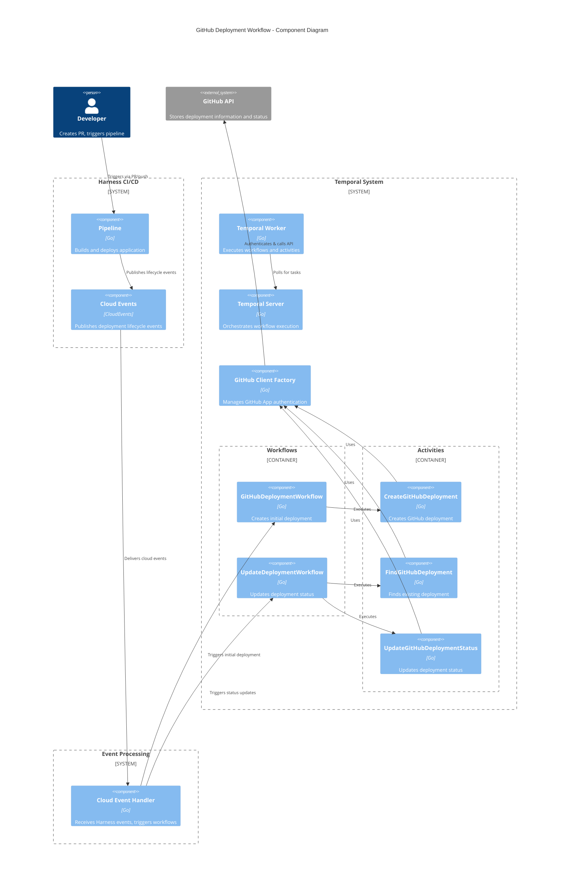
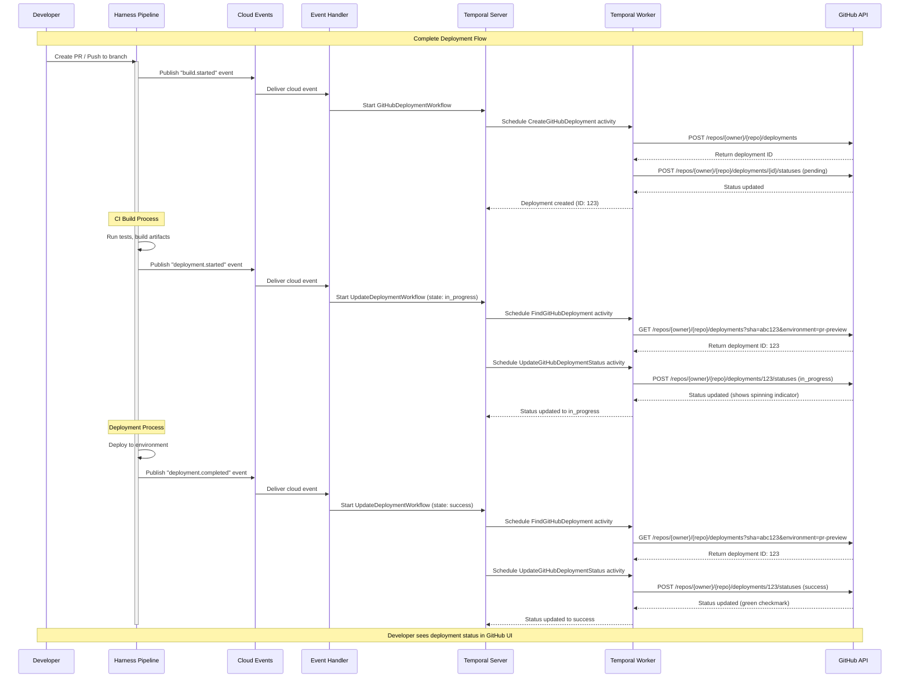
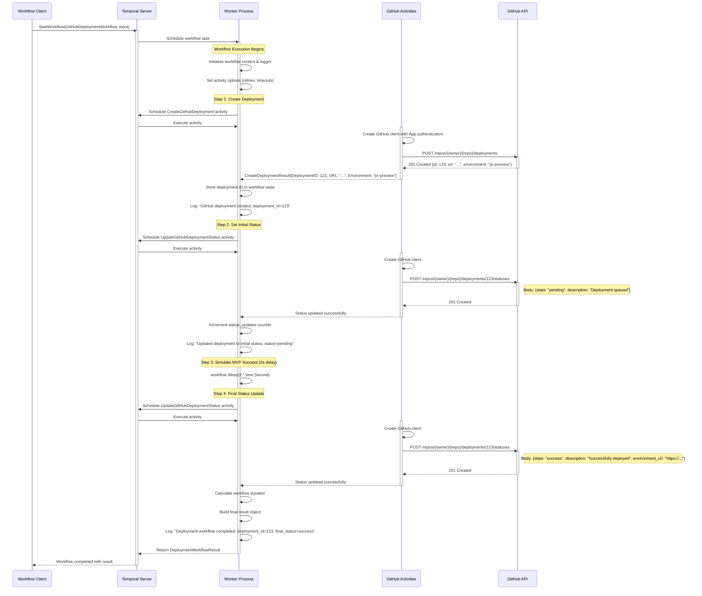
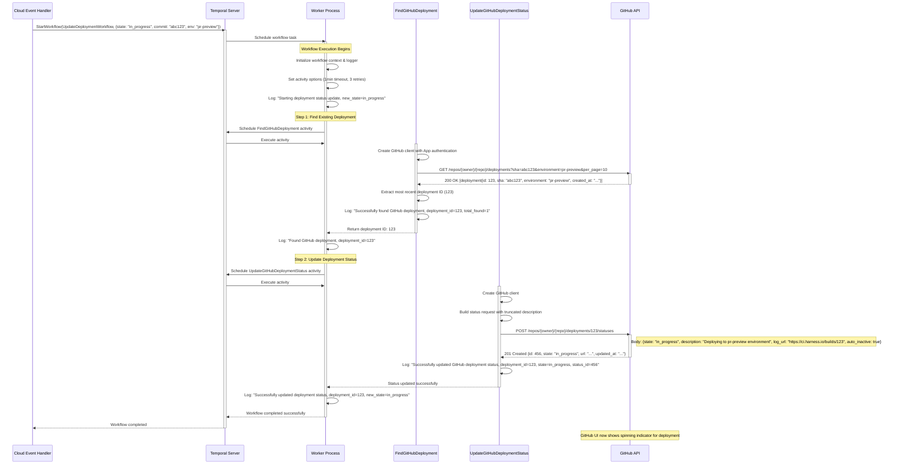

# Architecture Documentation

## C4 Component Diagram

## High-Level Sequence Diagram

## Low-Level Workflow Sequence

### GitHubDeploymentWorkflow (Creation)

### UpdateDeploymentWorkflow (Status Update)

